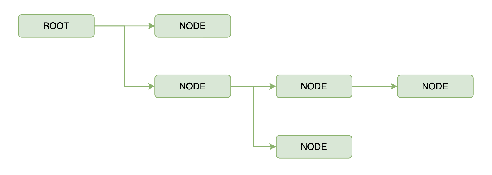
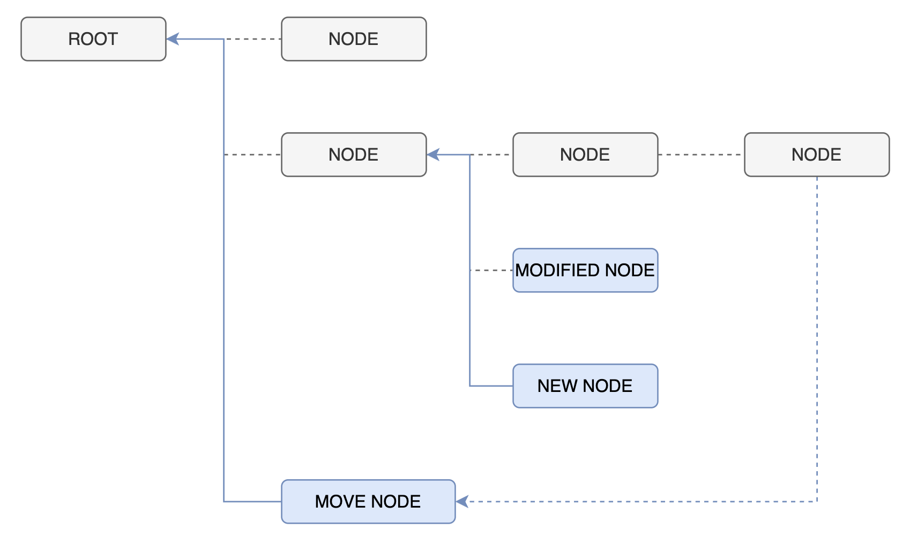

# Resolver 模式， 在 BFF 场景中比 GraphQL 更好的一个选择

[EN](./README-en.md)

这是一个基于 FastAPI 的 Resolver 模式和 GraphQL (strawberry) 模式的对比项目。

关注的是**项目内部前后端 API 调用**场景下的最佳开发模式

> 同样适用于 BFF backend for frontend 场景

> 默认读者已熟悉 GraphQL 和 RESTful，本文不再赘述基础概念。

比较的场景包括：

- [x] 关联数据的获取与构建
- [x] 查询参数的传递
- [x] 前端查询方式的比较
- [x] 数据在每个节点的后处理，最小成本构建视图数据 (重点)
- [x] 架构与重构的区别

> 虽然名叫 pydantic-resolve, dataclass 也是同样支持的

## 介绍

GraphQL 是一个优秀的 API 查询工具，广泛应用于各种场景。但它并非万能，针对不同场景也会遇到各种问题。

本文专门针对“项目内部前后端 API 对接”这一常见场景，分析 GraphQL 存在的问题，并尝试用基于 `pydantic-resolve` 的 Resolver 模式逐一解决。

先简单介绍一下什么是 Resolver 模式：这是一种基于现有 RESTful 接口，通过引入 resolver 和后处理概念，将原本“通用”的 RESTful 接口扩展为类似 RPC 的、专为前端页面定制数据的接口。

在 Resolver 模式中，我们基于 Pydantic 类进行扩展和数据组合。 (dataclass 也可以使用)

先上一段代码， 里面演示了获取关联数据和后处理之后生成视图数据的能力，文章后续会逐步解释所有功能和设计意图。

```python
class Story(BaseStory):
    tasks: list[BaseTask] = []
    def resolve_tasks(self, loader=LoaderDepend(TaskLoader)):
        return loader.load(self.id)

@ensure_subset(BaseStory)
class SimpleStory(BaseModel):
    id: int
    point: int

    name: str
    def resolve_name(self, ancestor_context):
        return f'{ancestor_context["sprint_name"]} - {self.name}'

    tasks: list[BaseTask] = []
    def resolve_tasks(self, loader=LoaderDepend(TaskLoader)):
        return loader.load(self.id)

    done_perc: float = 0.0
    def post_done_perc(self):
        if self.tasks:
            done_count = sum(1 for task in self.tasks if task.done)
            return done_count / len(self.tasks) * 100
        else:
            return 0

class Sprint(BaseSprint):
    __pydantic_resolve_expose__ = {'name': 'sprint_name'}

    simple_stories: list[SimpleStory] = []
    def resolve_simple_stories(self, loader=LoaderDepend(StoryLoader)):
        return loader.load(self.id)


@router.get('/sprints', response_model=list[Sprint])
async def get_sprints():
    sprint1 = Sprint(
        id=1,
        name="Sprint 1",
        start=datetime.datetime(2025, 6, 12)
    )
    sprint2 = Sprint(
        id=2,
        name="Sprint 2",
        start=datetime.datetime(2025, 7, 1)
    )
    return await Resolver().resolve([sprint1, sprint2] * 10)
```

它可以扮演类似 BFF 层的角色，相比传统 BFF 工具， 每层节点都引入了“后处理”方法，使许多原本需要遍历展开的汇总计算变得易如反掌。

更多关于 pydantic-resolve 的功能，请参见 [https://github.com/allmonday/pydantic-resolve](https://github.com/allmonday/pydantic-resolve)

## 启动项目

1. 安装依赖：
   ```sh
   python -m venv venv
   source venv/bin/activate  # windows 用户请自行替换
   pip install -r requirement.txt
   ```
2. 启动服务：
   ```sh
   uvicorn app.main:app --reload
   ```
3. 打开 [http://localhost:8000/graphql](http://localhost:8000/graphql) 访问 GraphQL playground。
4. 打开 [http://localhost:8000/docs](http://localhost:8000/docs) 查看 Resolver 模式

## 1. 数据获取和组合

```sh
uvicorn app.main:app --reload
```

Resolver 本身就是 GraphQL 的两个核心特色之一 （另一个是 Query 功能）， 通过 Resolver 和 dataloader， GraphQL 能够自由组合数据

GraphQL 中， 数据的定义可以是 Graph 的， 但事实上具体到每个查询， Query 的结构是树状的， 这也是为何不允许查询中只写对象名字但是不提供具体字段的原因

这是合法的查询

```graphql
query MyQuery {
  sprints {
    id
    name
    start
    stories {
      id
      name
      owner
    }
  }
}
```

这是不合法的查询

```graphql
query MyQuery {
  sprints {
    id
    name
    start
    stories  // playground 会飘红报错
  }
}
```

因为如果 stories 的字段还有对象类型的话， GraphQL 无法知道是否要继续展开。 因此本质上 Query 就是 Resolver 们的驱动查询的依据（配置）。

而在 Resolver 模式中， **Query 语句被固化到了代码中**， 通过 pydantic class 的继承和扩展来描述自己所期望的组合数据。

> 这种做法丧失了查询的灵活， 会更贴近于 RPC 的使用场景， 即文章开头所说的项目内部 API 对接场景， 让数据使用者不需要再额外承担一份查询语句的负担。
> 那如何判断自己是不是这种场景？ 最简单的例子是如果你的 Query 把特定入口中的对象的所有字段都用到了， 那么你大概就属于这个场景了。

如果直接继承 BaseStory 那么所有 BaseStory 的字段都会被返回， 也可以自己定义一个新的类， 把所需的字段申明在里面， 同时提供了 `@ensure_subset` 装饰器来额外保证字段名是 BaseStory 中真实存在的。

```python
class Story(BaseStory):
    tasks: list[BaseTask] = []
    def resolve_tasks(self, loader=LoaderDepend(TaskLoader)):
        return loader.load(self.id)


@ensure_subset(BaseStory)
class SimpleStory(BaseModel):  # how to pick fields..
    id: int
    name: str
    point: int

    tasks: list[BaseTask] = []
    def resolve_tasks(self, loader=LoaderDepend(TaskLoader)):
        return loader.load(self.id)

class Sprint(BaseSprint):
    stories: list[Story] = []
    def resolve_stories(self, loader=LoaderDepend(StoryLoader)):
        return loader.load(self.id)
```

另一个和 GraphQL 概念不同的地方是， GraphQL 的输入是用户查询语句， Resolver 的输入数据是根节点数据， 直接这么说也许有点抽象， 从代码上对比会比较形象一些：

在 GraphQL 中，当用户查询 sprints 时， 根数据的获取是发生在 sprints 方法内的。

```python
@strawberry.type
class Query:
    @strawberry.field
    def hello(self) -> str:
        return "hello world"

    @strawberry.field
    async def sprints(self) -> List[Sprint]:
        sprint1 = Sprint(
            id=1,
            name="Sprint 1",
            start=datetime.datetime(2025, 6, 12)
        )
        sprint2 = Sprint(
            id=2,
            name="Sprint 2",
            start=datetime.datetime(2025, 7, 1)
        )
        return [sprint1, sprint2] * 10
```

在 Resolver 中， 则需要提供一个根数据, 将其提供给 `Resolver().resolve` 方法中解析。

```python
@router.get('/sprints', response_model=list[Sprint])
async def get_sprints():
    sprint1 = Sprint(
        id=1,
        name="Sprint 1",
        start=datetime.datetime(2025, 6, 12)
    )
    sprint2 = Sprint(
        id=2,
        name="Sprint 2",
        start=datetime.datetime(2025, 7, 1)
    )
    return await Resolver().resolve([sprint1, sprint2] * 10)
```

这种方式对传统 RESTful 接口会很友好, 比如原本返回 flat 的 BaseSprint 对象的接口， 只要简单修改 response_model 定义类型就能无缝扩展了。

```python
@router.get('/base-sprints', response_model=list[BaseSprint])
async def get_base_sprints():
    sprint1 = BaseSprint(
        id=1,
        name="Sprint 1",
        start=datetime.datetime(2025, 6, 12)
    )
    sprint2 = BaseSprint(
        id=2,
        name="Sprint 2",
        start=datetime.datetime(2025, 7, 1)
    )
    return [sprint1, sprint2] * 10
```

当然， 如果你想模仿 GraphQL 那种形式的话， 也很容易：

```python
class Query(BaseModel):
    sprints: list[Sprint] = []
    async def resolve_sprints(self):
        sprint1 = Sprint(
            id=1,
            name="Sprint 1",
            start=datetime.datetime(2025, 6, 12)
        )
        sprint2 = Sprint(
            id=2,
            name="Sprint 2",
            start=datetime.datetime(2025, 7, 1)
        )
        return [sprint1, sprint2]

# resolve
await Resolver().resolve(Query())
```

就好了。

Resolver 的另一个能力是处理自引用类型数据的能力，
因为不用像 GraphQL 那样提供 Query 语句， 所以自引用类型（比如 Tree） 这类数据的构建逻辑可以完全交给后端来管理

作为对比， 在 GraphQL 中， 查询者因为不知道真实深度， 就需写出类似

```graphql
query MyQuery {
  tree {
    id
    children {
      id
      children {
        id
        children {
          id
          children {
            id
          }
        }
      }
    }
  }
}
```

这种非常深的查询语句， 同时也可能出现描述深度不够， 要继续调整查询的可能。

作为对比在 Resolver 或者说传统 RESTful 模式下, 只要定义好类型和返回值：

```python
@router.get('/tree', response_model=list[Tree])
async def get_tree():
    return [Tree(id=1, children=[
        Tree(id=2, children=[Tree(id=3)])
    ])]
```

然后简单 `curl http://localhost:8000/tree` 就搞定了。 深度问题交给后端具体逻辑去解决。

## 查询参数的传递

```sh
uvicorn app_filter.main:app --reload
```

graphql 可以在每个节点接收参数，每个 resolver 都能够接受一组 params

```python
@strawberry.type
class Sprint:
    id: int
    name: str
    start: datetime.datetime
    task_count: int = 0
    @strawberry.field
    async def stories(self, info: strawberry.Info, ids: list[int]) -> List["Story"]:
        stories = await info.context.story_loader.load(self.id)
        return [s for s in stories if s.id in ids]
```

不过在实际使用中， 为了方便动态设置， 一般都会放到顶部集中管理：

```graphql
// query
query MyQuery($ids: [Int!]!) {
  sprints {
    start
    name
    id
    stories(ids: $ids) {
      id
      name
      owner
      point
      tasks {
        done
        id
        name
        owner
      }
    }
  }
}

// variables
{
  "ids": [1]
}
```

这里隐含了一种参数集中化管理的设计思路，虽然参数的消费者在各个节点上，但是可以通过约定变量别名来集中获取。

Resolver 模式下， 因为查询本来就是通过代码提前“固化” 下来的， 所以可以通过 context 这种全局变量来提供所有的参数：

```python
class Sprint(BaseSprint):
    simple_stories: list[SimpleStory] = []
    async def resolve_simple_stories(self, context, loader=LoaderDepend(StoryLoader)):
        stories = await loader.load(self.id)
        stories = [s for s in stories if s.id in context['story_ids']]
        return stories

@router.get('/sprints', response_model=list[Sprint])
async def get_sprints():
    sprint1 = Sprint(
        id=1,
        name="Sprint 1",
        start=datetime.datetime(2025, 6, 12)
    )
    sprint2 = Sprint(
        id=2,
        name="Sprint 2",
        start=datetime.datetime(2025, 7, 1)
    )
    return await Resolver(
        context={'story_ids': [1, 2, 3]},
    ).resolve([sprint1, sprint2] * 10)
```

在形式上和 GraphQL 的做法是等价的。

到这里你也许注意到提供的 ids 的用法中， 获取了 stories 之后再通过代码来过滤是一种非常低效的做法， 更好的方式显然是传递给 Dataloader 然后让它在数据获取的过程中就完成过滤的功能。

在 GraphqlQL 场景中， Dataloader 只有通过 `loader.load(params)` 方法中的 params 来设置， 所以想要实现这个功能只有一些比较变扭的写法， 比如把 id 和 ids 一起通过 params 传递到 dataloader 中

```python
  @strawberry.field
  async def stories2(self, info: strawberry.Info, ids: list[int]) -> List["Story"]:
      stories = await info.context.story_loader.load((self.id, ids))
      return stories
```

然后在 Dataloader 内部拆分出来， 这时 Tuple 中的第二个参数实际上是非常冗余的存在。

```python
async def batch_load_stories_with_filter(input: List[Tuple[int, List[int]]]) -> List[List["Story"]]:
    await asyncio.sleep(0.01)  # Simulate async DB call
    sprint_ids = [item[0] for item in input]
    story_ids = input[0][1] # need extra code to check the length of input
    sprint_id_to_stories: Dict[int, List[Story]] = {sid: [] for sid in sprint_ids}

    for s in STORIES_DB:
        if s["sprint_id"] in sprint_id_to_stories:
            if not story_ids or s["id"] in story_ids:
              sprint_id_to_stories[s["sprint_id"]].append(Story(id=s["id"], name=s["name"], owner=s["owner"], point=s["point"]))
    return [sprint_id_to_stories[sid] for sid in sprint_ids]
```

而在 Resolver 这种多入口的模式中， 这个问题解决起来就非常简单，直接给 Dataloader 类添加字段 story_ids

```python
class StoryLoader(DataLoader):
    story_ids: List[int]
    async def batch_load_fn(self, sprint_ids: List[int]) -> List[List[BaseStory]]:
        await asyncio.sleep(0.01)  # Simulate async DB call
        sprint_id_to_stories = {sid: [] for sid in sprint_ids}
        for s in STORIES_DB:
            if s["sprint_id"] in sprint_id_to_stories:
                if not self.story_ids or s["id"] in self.story_ids:
                    sprint_id_to_stories[s["sprint_id"]].append(s)
        return [sprint_id_to_stories[sid] for sid in sprint_ids]
```

然后在 Resolver() 方法中直接传递参数

```python
return await Resolver(
  loader_params={
      StoryLoader: {
          'story_ids': [1, 2, 3]
      },
  }
).resolve([sprint1, sprint2] * 10)
```

另外， `pydantic-resolve` 还提供了 parent 来获取父节点对象， 提供了 `ancestor_context` 来获取祖先节点的特定字段。 这些都是目前 GraphQL 框架普遍不支持的功能。 具体使用方式可以移步 [ancestor_context](https://allmonday.github.io/pydantic-resolve/api/#ancestor_context), [parent](https://allmonday.github.io/pydantic-resolve/api/#parent)。

总结一下：

| 参数类型     | Resolver | GraphQL  |
| ------------ | -------- | -------- |
| 节点         | 支持     | 支持     |
| 全局 context | 支持     | 支持     |
| 父节点       | 支持     | 有限支持 |
| 祖先节点     | 支持     | 不支持   |
| dataloader   | 支持     | 不支持   |

## 前端查询方式的差别

使用 GraphQL，前端需要维护 query 语句, 虽然也有人把 query 固化成了 RPC，但是这些都是需要堆积额外技术复杂度的做法。

一般不会有人直接使用 fetch 来构建 GraphQL query, 通常都会使用 Apollo client 之类的工具来查询。

另外在 TypeScript 流行的当下， 为了生成前端类型定义， 还需要借助 GraphQL code generator, GraphQL Typescript Generator 之类的生成工具。

而在 Resolver 模式下，借助 FastAPI 和 pydantic， 通过 OpenAPI 3.x 可以直接把 RESTful API 生成 sdk，前端可以直接调用 RPC 方法和类型定义。 比如 openapi-ts。

而 OpenAPI 3.x 标准是个非常成熟的标准， 各种工具的稳定性也很高。 还有 Swagger 可以查看 API 的定义和返回类型。

另外， Resolver 模式的书写本身也不复杂，甚至让前端自己过来拼装数据也是可行的（类似 BFF 模式），当然如果是全栈模式会更加便捷。

| API             | Resolver | GraphQL          |
| --------------- | -------- | ---------------- |
| 提供 Query 语句 | 不需要   | 需要             |
| 提供类型        | 支持     | 支持 (相对麻烦)  |
| 生成 SDK        | 支持     | 支持（相对复杂） |
| 修改后前端感知  | 强       | 相对弱           |

## 数据在每个节点的后处理，轻松构建视图数据

```sh
uvicorn app_post_process.main:app --reload
```

如果说前面的对比还是小打小闹的话， 那么后处理的能力是 Resolver 模式和 GraphQL 模式差异最大的部分。

先来简单演示一下什么是后处理， 下面的方法做了几件事情：

- 修改 story.name, 添加 sprint.name 作为前缀
- 根据 story.tasks 计算 story.done_perc

```python
def post_process(sprints: List[Sprint]) -> List[Sprint]:
    for sprint in sprints:
        sprint_name = sprint.name

        for story in sprint.simple_stories:
            story.name = f"{sprint_name} - {story.name}"
            if story.tasks:
                done_count = sum(1 for task in story.tasks if task.done)
                done_perc = done_count / len(story.tasks) * 100
            else:
                done_perc = 0
            story.done_perc = done_perc

            for task in story.tasks:
                ...

    return sprints
```

可以看出这段代码如果增加更多的后处理需求，或者更多的节点层数， 可读性会快速下降。

在 Resolver 模式中可以这样来表达：

```python
@ensure_subset(BaseStory)
class SimpleStory(BaseModel):
    ...

    name: str
    def resolve_name(self, ancestor_context):
        # 因为 name 已经有的数据， 所以即使在 resolver 中也可以操作。
        # ancestor_context 代表自己的直系祖先节点中定义的变量。 在这里指 sprint.name
        return f'{ancestor_context['sprint_name']} - {self.name}'

    done_perc: float = 0.0
    def post_done_perc(self):
        if self.tasks:
            done_count = sum(1 for task in self.tasks if task.done)
            return done_count / len(self.tasks) * 100
        else:
            return 0

class Sprint(BaseSprint):
    __pydantic_resolve_expose__ = {'name': 'sprint_name'}

    simple_stories: list[SimpleStory] = []
    def resolve_simple_stories(self, loader=LoaderDepend(StoryLoader)):
        return loader.load(self.id)
```

祖先节点的字段通过特定的 ancestor_context 来传递， 不污染 locals

而 done_perc 则是依靠在节点的局部进行计算

可维护性会改善不少

---

在 GraphQL 中，受限于它 Query 的功能， 后处理能力可以说是基本无法实现的。

许多 GraphQL 框架最多只支持根节点上提供一个后处理的 middleware, 即所有数据都获取之后， 开发可以做一些处理.

而在 Resolver 模式中， 每个节点都能够在子孙数据的处理完成之后， 提供 post hook 来做额外处理。

这是 resolve 的过程， 从 ROOT 节点开始一层层扩展数据



这是后处理的过程， 当所有通过 resolver 获取的数据都完成后， 会有个层层返回触发的过程。



这里先说明后处理方法的意义：

- 可以在每层节点上，当其子孙字段都处理完毕之后，修改字段， 或者读取子孙节点的数据， 来实现各种统计或者聚合操作
  - 比如根据 Task.done 的情况统计出 Story 的完成率
- 可以对节点数据做跨层的移动，比如把 Task 节点移动到 Sprint 节点下面
- 可以对节点做跨层的统计聚合，比如在 Sprint 中跨过 Story 层的中转就能统计出有多少 Task

很遗憾在 GraphQL 的设计中， 后处理的概念是不存在的，

使用 graphql 只能经历一个数据从上到下的获取过程， 想要实现每层的后处理是没有办法的， 比如我在 story 节点中是无法提前知道 tasks 中的内容的。

并且 Query 驱动 resolver 的方式约束了后处理方法中， 新增字段的可能。

比如在 Resolver 模式中， 可以使用 post_done_perc 方法， 获取 `self.tasks` 信息， 然后计算出 done 的比例

```python
@ensure_subset(BaseStory)
class SimpleStory(BaseModel):  # how to pick fields..
    id: int
    name: str
    point: int

    tasks: list[BaseTask] = []
    def resolve_tasks(self, loader=LoaderDepend(TaskLoader)):
        return loader.load(self.id)

    done_perc: float = 0.0
    def post_done_perc(self):
        if self.tasks:
            done_count = sum(1 for task in self.tasks if task.done)
            return done_count / len(self.tasks) * 100
        else:
            return 0.0
```

而在 GraphQL 中，哪怕由于某种能力支持了节点级别的后处理， 对于 done_perc 这种依赖于 tasks 的数据， 如果 Query 中只申明了 `done_perc` 却没有申明 `tasks` 的话， 那么 Query 驱动查询时， done_perc 就会因为没有 tasks 的数据报错。 如果硬要支持的话， 那么就需要某种静态分析过程把 done_perc 对于 tasks 的依赖提前分析出来。

正是后处理的能力， 让 Resolver 获得轻松构建视图数据的能力，使基于数据的二次构建和修改成为可能。

这里罗列一些 Resolver 模式支持的后处理功能:

| 后处理能力                                                                                          | Resolver        | GraphQL |
| --------------------------------------------------------------------------------------------------- | --------------- | ------- |
| 修改当前字段数据 [post](https://allmonday.github.io/pydantic-resolve/api/#post)                     | 支持            | 无      |
| 读取当前节点的子孙数据                                                                              | 支持            | 无      |
| 将数据传送到某个子孙节点下 [collector](https://allmonday.github.io/pydantic-resolve/api/#collector) | 支持            | 无      |
| 在序列化中隐藏字段                                                                                  | 支持 (pydantic) | 无      |

也可以查看代码 `app_post_process/rest.py` 中的更多例子。

## 架构设计的区别

这个环节聊聊 GraphQL 在项目迭代中的使用感受。

GraphQL 在重构的时候， 最大的阻碍是不敢修改已有的 schema， 因为不知道 schema 中哪些字段被查询了， 哪些没有被查询。

这就导致只要是提供过的字段， 基本结构就被约束住不能轻易调整了， 否则就要 audit 所有查询确认情况。

因为 GraphQL 的灵活性， 不同的 team 使用方式也各不相同， 有些人会根据 ER 模型， 比如我们的 demo 中那样， 构建后端比较友好的 schema， 也有人会根据前端的视图模型， 糅合许多后处理的过程， 构建前端更友好的 schema, 但这两种思路因为 GraphQL 缺少强大的后处理能力， 无法结合到一起。

**总结**： GraphQL 因为缺失了良好的后处理方法， 会导致 schema 设计陷入 ER model 优先还是 view model 优先两难的境地。

一般平台提供的 GraphQL schema 都是遵循前者， 即贴近 ER 模型的方式设计的。 把转换到前端视图数据的过程委托给查询方来处理。

而在 Resolver 模式中， 因为前端消费的视图模型实际上是维护在后端的， 所以字段的使用情况开发是清清楚楚的。

得益于 RESTful 的多入口，以及良好的和继承，扩展机制， 可以做到每个接口的调整， 都不会影响到其他接口。

在架构上， Resolver 模式匹配了 ER 模型 -> 视图模型过程中， 结构稳定性逐渐递减的客观情况。

ER 模型的 Base 类型非常稳定， 通过继承和关联数据按照需要来拼装出业务对象, 再通过后处理过程调整出视图对象。

于是，Resolver 方式可以做到在符合 ER 模型的基础上， 流畅地构建出各种个样的业务所需的具体视图数据。

**总结**： Resolver 模式在 ER 模型的基础上， 通过具体业务拼装数据， 然后使用后处理把数据微调成期望的视图数据。 提供了良好的可读性和可维护性。

## 彩蛋

那怎么给 GraphQL 添加后处理方法呢？

这里提供一种有趣的思路，删除所有的 resolve 方法，删除所有的 Dataloader， 直接把 GraphQL 的查询结果作为输入数据。

然后保留所有的 post 方法， 让他们将数据转换成期望的视图对象。

> 因为 pydantic 本身就拥有加载嵌套数据的能力

```python
@ensure_subset(BaseStory)
class SimpleStory(BaseModel):  # how to pick fields..
    __pydantic_resolve_collect__ = {'tasks': ('task_count', 'task_count2')}  # send tasks to collectors

    id: int
    name: str
    point: int
    tasks: list[BaseTask]

    done_perc: float = 0.0
    def post_done_perc(self):
        if self.tasks:
            done_count = sum(1 for task in self.tasks if task.done)
            return done_count / len(self.tasks) * 100
        else:
            return 0

class Sprint(BaseSprint):
    simple_stories: list[SimpleStory]
    task_count: int = 0
    def post_task_count(self, collector=Collector(alias='task_count', flat=True)):
        return len(collector.values())  # this can be optimized further


@router.get('/sprints', response_model=list[Sprint])
async def get_sprints():
    sprints = await graphql_api_provider.query_sprints() # read from graphql res.data
    sprints = [Sprint.model_validate(s) for s in sprints]
    return await Resolver().resolve(sprints)
```

## 聊聊 Resolver 模式的设计哲学

Resolver 模式的核心是根据业务设计描述数据结构。

当我们移除所有的 resolver 和 post 方法后， 剩下的就是我们想要定义的业务对象本身。

而这些方法只不过是告知该如何去获得/计算这些数据。

**数据结构是最重要的资产**， 获取方式可以随意替换/优化。

```python
class SimpleStory(BaseModel):  # how to pick fields..
    id: int
    name: str
    point: int

    tasks: list[BaseTask]
    done_perc: float

class Sprint(BaseSprint):

    simple_stories: list[SimpleStory]
    task_count: int
```

让我们从头复盘一下设计过程：

通过 ER 模型我们可以定义好数据之间的关系， 它是所有数据之间进行组合的“约束条件”。 比如 Sprint -> Story 遵循的是 1: N 的关系。

因此可以为 Sprint 添加 stories 字段。

此时通过添加默认值， 我们默认允许这个对象初始化时， 不去理会这些值的缺失， 因为数据会在后续处理中被设置。 这个处理可能发生在 resolver 也可能发生在 post.

> 换言之，如果你初始化数据中已经包含了 tasks 数据， 那么 `tasks: list[BaseTask]` 就不需要设置 `[]` 默认值， 记住 pydantic 支持加载嵌套的数据。

```python
class SimpleStory(BaseModel):  # how to pick fields..
    id: int
    name: str
    point: int

    tasks: list[BaseTask] = []
    done_perc: float = 0

class Sprint(BaseSprint):
    simple_stories: list[SimpleStory] = []
```

然后就是为这些待查询的值设置 resolver 方法

```python
class SimpleStory(BaseModel):  # how to pick fields..
    id: int
    name: str
    point: int

    tasks: list[BaseTask] = []
    def resolve_tasks(self, loader=LoaderDepend(TaskLoader)):
        return loader.load(self.id)

    done_perc: float = 0

class Sprint(BaseSprint):
    simple_stories: list[SimpleStory] = []
    def post_task_count(self, collector=Collector(alias='task_count', flat=True)):
        return len(collector.values())  # this can be optimized further
```

还有一些值， 它需要等待 tasks 数据全部获取完之后才能算出来， 那就需要通过 post 方法来进行设置。

```python
@ensure_subset(BaseStory)
class SimpleStory(BaseModel):  # how to pick fields..
    __pydantic_resolve_collect__ = {'tasks': ('task_count', 'task_count2')}  # send tasks to collectors

    id: int
    name: str
    point: int
    tasks: list[BaseTask]

    done_perc: float = 0.0
    def post_done_perc(self):
        # self.tasks is filled with real values
        if self.tasks:
            done_count = sum(1 for task in self.tasks if task.done)
            return done_count / len(self.tasks) * 100
        else:
            return 0

class Sprint(BaseSprint):
    simple_stories: list[SimpleStory]
    task_count: int = 0
    def post_task_count(self, collector=Collector(alias='task_count', flat=True)):
        return len(collector.values())  # this can be optimized further
```

> 如果还有一些值， 要根据 post 的计算产出物才能算出来， pydantic-resolve 提供了 `post_default_handler` 来处理。

**因此 pydantic 对象定义的是期望的数据结构 （接口设计）， 而 resolver 和 post 方法只是提供具体的实现方式。**

> 之所以推荐使用 Dataloader 因为它在查询复杂度和运行效率两者间平衡做的最好， 但就如前文所说， 当有更好/更快的方式可以获取关联数据时 （比如优化过的 ORM 查询）， 我们只需要删除 resolver 和 Dataloader 就能立即完成代码重构。
> pydantic 可以加载嵌套对象， 所以不需要限制自己在 resolver 中返回 flat 的对象数据。 （嵌套的 dict 都是 ok 的）

## Resolver 与 GraphQL 模式对比

| 特性       | Resolver 模式                    | GraphQL 模式                     |
| ---------- | -------------------------------- | -------------------------------- |
| 接口设计   | 基于 URL 路径和 HTTP 方法        | 基于单一端点和类型化 Schema      |
| 数据获取   | 单独接口，内部代码静态构建       | 单次请求可获取多资源，按需查询   |
| 灵活性     | 固定返回结构，也能灵活定义字段   | 前端可自定义查询字段，灵活性更高 |
| 文档与类型 | Swagger/OpenAPI3.0, 支持生成 SDK | 自动生成 Playground，类型强校验  |

本项目同时实现了 Resolver 和 GraphQL 两种接口，便于对比和学习两者的使用方式及优缺点。

### GraphQL

灵活， 可以查询，适合需要对数据做灵活查询的场景


### Resolver

使用 [pydantic-resolve](https://github.com/allmonday/pydantic-resolve)

使用更少的技术栈， 来构建等价的数据结构， 适合项目内部 api 对接的场景

可以使用 https://github.com/hey-api/openapi-ts 之类的工具生成前端 sdk


## Benchmark

最后， 使用 Resolver 模式并不会影响接口的性能， 反而可以变得更快。

你可以轻松的使用 Resolver 重构 GraphQL 代码， 这个过程并不会有太多心智负担， 反而会精简各种代码。

因此， 对于**项目内部前后端 API 对接** 的场景， Resolver 模式会是一种可靠的选择。

这里对比 app 目录下纯拼装的性能对比， 同时还引入了 dataclass 的 case

```
uvicorn app_bench.main:app
```

`ab -c 50 -n 1000`

### Resolver

pydantic: 418 req/sec

```shell
Concurrency Level:      50
Time taken for tests:   2.390 seconds
Complete requests:      1000
Failed requests:        0
Total transferred:      5078000 bytes
HTML transferred:       4951000 bytes
Requests per second:    418.34 [#/sec] (mean)
Time per request:       119.521 [ms] (mean)
Time per request:       2.390 [ms] (mean, across all concurrent requests)
Transfer rate:          2074.53 [Kbytes/sec] received

Connection Times (ms)
              min  mean[+/-sd] median   max
Connect:        0    0   0.3      0       1
Processing:    30  116  10.4    116     149
Waiting:       29  115  10.4    114     149
Total:         31  116  10.4    116     150

Percentage of the requests served within a certain time (ms)
  50%    116
  66%    120
  75%    123
  80%    124
  90%    128
  95%    131
  98%    141
  99%    148
 100%    150 (longest request)
```

dataclass: 499 req/sec

```shell
Concurrency Level:      50
Time taken for tests:   2.001 seconds
Complete requests:      1000
Failed requests:        0
Total transferred:      5078000 bytes
HTML transferred:       4951000 bytes
Requests per second:    499.70 [#/sec] (mean)
Time per request:       100.060 [ms] (mean)
Time per request:       2.001 [ms] (mean, across all concurrent requests)
Transfer rate:          2478.01 [Kbytes/sec] received

Connection Times (ms)
              min  mean[+/-sd] median   max
Connect:        0    0   0.2      0       1
Processing:    25   98  10.4     95     125
Waiting:       25   96   9.7     94     125
Total:         25   98  10.4     96     125

Percentage of the requests served within a certain time (ms)
  50%     96
  66%    101
  75%    105
  80%    107
  90%    112
  95%    116
  98%    119
  99%    123
 100%    125 (longest request)
------------ graphql------------
This is ApacheBench, Version 2.3 <$Revision: 1913912 $>
Copyright 1996 Adam Twiss, Zeus Technology Ltd, http://www.zeustech.net/
Licensed to The Apache Software Foundation, http://www.apache.org/

Benchmarking localhost (be patient)
Completed 100 requests
Completed 200 requests
Completed 300 requests
Completed 400 requests
Completed 500 requests
Completed 600 requests
Completed 700 requests
Completed 800 requests
Completed 900 requests
Completed 1000 requests
Finished 1000 requests
```

### GraphQL

strawberry: 289 req/sec

```shell
Server Software:        uvicorn
Server Hostname:        localhost
Server Port:            8000

Document Path:          /graphql
Document Length:        4883 bytes

Concurrency Level:      50
Time taken for tests:   3.453 seconds
Complete requests:      1000
Failed requests:        0
Total transferred:      5010000 bytes
Total body sent:        382000
HTML transferred:       4883000 bytes
Requests per second:    289.59 [#/sec] (mean)
Time per request:       172.656 [ms] (mean)
Time per request:       3.453 [ms] (mean, across all concurrent requests)
Transfer rate:          1416.86 [Kbytes/sec] received
                        108.03 kb/s sent
                        1524.89 kb/s total

Connection Times (ms)
              min  mean[+/-sd] median   max
Connect:        0    0   0.2      0       1
Processing:    27  169  14.0    171     242
Waiting:       26  167  13.9    168     240
Total:         27  169  14.0    171     243

Percentage of the requests served within a certain time (ms)
  50%    171
  66%    173
  75%    174
  80%    175
  90%    177
  95%    180
  98%    194
  99%    216
 100%    243 (longest request)
```

## 彩蛋 2

先看一下 strawberry 中描述数据的方式， 可以发现里面存在数据耦合的情况。

```python
@strawberry.type
class Task:
    id: int
    name: str
    owner: int
    done: bool

@strawberry.type
class Story:
    id: int
    name: str
    owner: int
    point: int
    @strawberry.field
    async def tasks(self, info: strawberry.Info) -> List["Task"]:
        results = await info.context.task_loader.load(self.id)
        return [TaskBase(**task) for task in results]

@strawberry.type
class Sprint:
    id: int
    name: str
    start: datetime.datetime
    task_count: int = 0
    @strawberry.field
    async def stories(self, info: strawberry.Info) -> List["Story"]:
        results = await info.context.story_loader.load(self.id)
        return [Story(**story) for story in results]
```

如果按继承 + 扩展的思路重写，那么我们可以重构为基本元素和组合元素。

```python
@strawberry.type
class TaskBase:
    id: int
    name: str
    owner: int
    done: bool

@strawberry.type
class StoryBase:
    id: int
    name: str
    owner: int
    point: int

@strawberry.type
class SprintBase:
    id: int
    name: str
    start: datetime.datetime

@strawberry.type
class Story(StoryBase):
    @strawberry.field
    async def tasks(self, info: strawberry.Info) -> List["TaskBase"]:
        results = await info.context.task_loader.load(self.id)
        return [TaskBase(**task) for task in results]

@strawberry.type
class Sprint(SprintBase):
    @strawberry.field
    async def stories(self, info: strawberry.Info) -> List["Story"]:
        results = await info.context.story_loader.load(self.id)
        return [Story(**story) for story in results]
```

注意， strawberry.type 是一个兼容 dataclass 的装饰器， 因此可以就地取材直接拿来拼装 resolver 结构

```python
from .graphql import batch_load_tasks, batch_load_stories, StoryBase, TaskBase, SprintBase

@ensure_subset(StoryBase)
@strawberry.type
class SimpleStory():  # how to pick fields..
    id: int
    name: str
    point: int

    tasks: list[TaskBase] = field(default_factory=list)

    def resolve_tasks(self, loader=LoaderDepend(batch_load_tasks)):
        return loader.load(self.id)

@strawberry.type
class Sprint(SprintBase):
    stories: list[SimpleStory] = field(default_factory=list)

    def resolve_stories(self, loader=LoaderDepend(batch_load_stories)):
        return loader.load(self.id)
```

这样有什么好处呢？

首先我们知道 GraphQL 的优势是优秀的文档，灵活的代码查询， 提供了宏观角度对数据结构的观察和管理。

Resolver 能够根据 Use case， 在局部拼装的过程中， 通过复用 dataloader 和 type， 再加上强大的后处理功能， 提供最高效便捷的 JSON-RPC 接口和数据。
